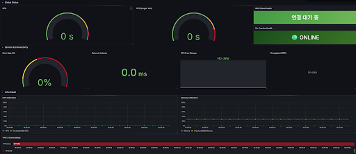

# hard_project
# 🛡️ Hybrid-Cloud Disaster Recovery Monitoring System

온프레미스 서버와 AWS 클라우드 간의 가상 사설망(VPN) 연결 및 재해 복구(DR) 상태를 실시간으로 관제하는 모니터링 시스템입니다.

## 📊 Monitoring Dashboard (Grafana)

### 1. 핵심 관제 지표 (Global Status)
* **On-Premise / AWS Health:** 각 센터 서버의 생존 상태를 실시간으로 확인합니다. (ONLINE/OFFLINE)
* **Real-time RTO (Recovery Time Objective):** 장애 발생 후 복구까지 걸리는 시간을 측정하며, 목표치(10분) 초과 시 시각적 경고를 보냅니다.
* **Real-time RPO (Recovery Point Objective):** 데이터 유실 지점을 모니터링하여 DB 동기화 상태를 체크합니다.

### 2. 서비스 및 네트워크 지연 (Service & Connectivity)
* **Network Latency (ms):** 클라우드 간 통신 지연 시간을 밀리초 단위로 추적하여 연결 품질을 감시합니다.
* **Error Rate (%):** 사용자에게 발생하는 HTTP 5xx 에러율을 게이지로 표시합니다.
* **NFS Free Storage:** 복제 데이터가 저장될 공유 스토리지의 잔여 용량을 감시합니다.

### 3. 인프라 상세 자원 (Infra Detail)
* **CPU/Memory Utilization:** 서버 자원 과부하 상태를 0-100% 범위로 시각화합니다.
* **VPN / Tunnel Status:** Cloudflare Tunnel을 통한 연결 이력을 타임라인으로 기록하여 과거 장애 시점을 추적합니다.

## 🛠 Tech Stack
* **Monitoring:** Prometheus, Grafana
* **Data Collector:** Node Exporter
* **Connectivity:** Cloudflare Tunnel (VPN)
* **Infrastructure:** On-premise Server, AWS EC2 (EKS)

## 📂 Project Structure
* `/prometheus`: Prometheus 설정 파일 (`prometheus.yml`) 및 실행 가이드
* `/grafana`: 대시보드 JSON 템플릿 및 설정값
