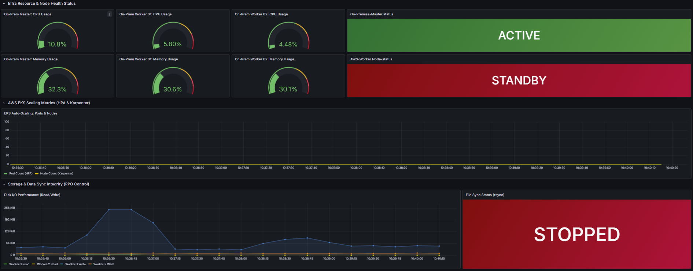

# hard_project
# 🛡️ Hybrid-Cloud Disaster Recovery Monitoring System

온프레미스 서버와 AWS 클라우드 간의 가상 사설망(VPN) 연결 및 재해 복구(DR) 상태를 실시간으로 관제하는 모니터링 시스템입니다.

## 📊 Monitoring Dashboard (Grafana)
(images/dash2.png)

### 1. 핵심 관제 지표 (Global Status)
* **On-Premise / AWS Health:** 각 센터 서버의 생존 상태를 실시간으로 확인합니다. (ONLINE/OFFLINE)
* **Real-time RTO (Recovery Time Objective):** 장애 발생 후 복구까지 걸리는 시간을 측정하며, 목표치(10분) 초과 시 시각적 경고를 보냅니다.
* **Real-time RPO (Recovery Point Objective):** 데이터 유실 지점을 모니터링하여 DB 동기화 상태를 체크합니다.

### 2. 서비스 및 네트워크 지연 (Service & Connectivity)
* **Network Latency (ms):** 클라우드 간 통신 지연 시간을 밀리초 단위로 추적하여 연결 품질을 감시합니다.
* **Error Rate (%):** 사용자에게 발생하는 HTTP 5xx 에러율을 게이지로 표시합니다.
* **NFS Free Storage:** 복제 데이터가 저장될 공유 스토리지의 잔여 용량을 감시합니다.

### 3. 인프라 상세 자원 (Infra Detail)
* **CPU/Memory Utilization:** 서버 자원 과부하 상태를 0-100% 범위로 시각화합니다.
* **VPN / Tunnel Status:** Cloudflare Tunnel을 통한 연결 이력을 타임라인으로 기록하여 과거 장애 시점을 추적합니다.

### 4. Monitoring Automation & Optimization
* IaC 기반 설정 자동화: 앤서블 동적 인벤토리를 활용하여 Karpenter 등으로 인해 수시로 변하는 AWS 노드 IP를 사람의 개입 없이 프로메테우스 타겟에 즉시 반영.
* 데이터 연속성 보장 (Labeling): 인스턴스 재생성 시 IP가 변경되어도 고정된 node_name 라벨을 유지하여 Grafana 대시보드의 메트릭 단절 현상 해결.
* 배포 파이프라인 최적화: GitHub Actions Runner 내에 boto3 등 필수 의존성을 포함시켜, 로컬 환경에 구애받지 않는 독립적인 배포 환경 구축.

## 🛠 Tech Stack
* **Monitoring:** Prometheus, Grafana
* **Data Collector:** Node Exporter
* **Connectivity:** Cloudflare Tunnel (VPN)
* **Infrastructure:** On-premise Server, AWS EC2 (EKS)
* Ansible Dynamic Inventory: AWS API 연동을 통한 가변 IP 인스턴스 자동 추적 및 관리
* Jinja2 Templating: Prometheus 설정 파일(.yml)의 동적 생성 및 배포 자동화
* GitHub Actions CI/CD: 인프라 변경 사항 실시간 반영 및 패키지 의존성 자동 해결

## 📂 Project Structure
* `/prometheus`: Prometheus 설정 파일 (`prometheus.yml`) 및 실행 가이드
* `/grafana`: 대시보드 JSON 템플릿 및 설정값

## 🛠 Troubleshooting & Optimization

프로젝트 구축 과정에서 발생한 주요 기술적 이슈와 해결 과정을 기록합니다.

### 1. 가변 IP 환경에서의 타겟 인식 및 배포 자동화
* **Issue:** 테라폼 인프라 업데이트 및 Karpenter 노드 재생성 시 EC2의 Public IP가 수시로 변경되어 모니터링 단절 발생.
* **Solution:** * Ansible **Dynamic Inventory(`aws_ec2`)**를 도입하여 실시간으로 실행 중인 인스턴스 IP를 페칭.
    * Prometheus 설정 파일을 **Jinja2 템플릿**화하여 배포 시점에 최신 IP가 자동 기입되도록 파이프라인 구축.
* **Result:** 인프라 변경 후 별도의 수동 수정 없이 GitHub Actions 배포만으로 모니터링 환경 동기화 완료.

### 2. Grafana 메트릭 데이터의 연속성 보장 (Labeling)
* **Issue:** 서버 재생성 후 IP가 바뀌면 그라파나가 이를 새로운 인스턴스로 인식하여 기존 데이터와 그래프가 끊기는 현상 발생.
* **Solution:** Prometheus의 `relabel_configs`를 활용하여 IP 기반의 `instance` 라벨 대신, Ansible에서 부여한 고정 논리 이름인 `node_name` 라벨을 메트릭의 식별자로 강제 매핑.
* **Result:** 서버가 삭제되고 재생성되어도 동일한 이름표(Label)를 유지함으로써 대시보드의 **데이터 연속성 확보**.

### 3. GitHub Actions 배포 동시성 제어 및 Helm Lock 이슈
* **Issue:** 협업 과정에서 다수의 배포가 겹치거나 비정상 종료될 때 `UPGRADE FAILED: another operation in progress` 에러와 함께 배포가 중단됨.
* **Solution:** * `helm list`를 통한 릴리즈 상태 점검 및 `helm rollback` 명령어로 Pending 상태의 락(Lock) 해제.
    * 팀원 간 작업 현황 실시간 공유 및 인프라 변경 시점 조율 프로세스 확립.

### 4. 대규모 불필요 파일 추적(10K+ files)으로 인한 Git 성능 저하
* **Issue:** Python 가상환경(`venv`) 폴더가 `.gitignore` 설정 전 Index에 포함되어 1만 개 이상의 불필요한 파일이 커밋 대상에 포함됨.
* **Solution:** `git rm -r --cached .` 명령을 통해 전체 캐시를 초기화한 후, 정교화된 `.gitignore`를 재적용하여 순수 소스 코드만 관리하도록 정형화.
