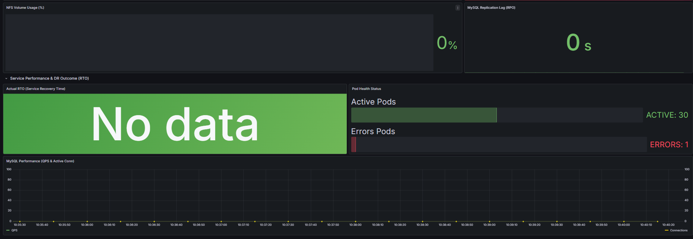

# hard_project
# 🛡️ Hybrid-Cloud Disaster Recovery Monitoring System

온프레미스 서버와 AWS 클라우드 간의 가상 사설망(VPN) 연결 및 재해 복구(DR) 상태를 실시간으로 관제하는 모니터링 시스템입니다.

## 📊 Monitoring Dashboard (Grafana)

### 1️⃣ 인프라 자원 및 노드 생존 상태 (Infra Resource & Node Health Status)
* **On-Premise Resource Usage:** Master, Worker 01, Worker 02 노드의 CPU 및 Memory 사용량을 게이지(Gauge) 차트로 시각화하여 자원 과부하를 실시간 감시합니다.
* **On-Premise Master Status:** 온프레미스 메인 서버의 실시간 생존 상태를 표시합니다. (**ACTIVE** - 정상 가동 시 녹색)
* **AWS-Worker Node Status:** 클라우드 재해 복구용 복제 노드의 대기 상태를 모니터링합니다. (**STANDBY** - 대기 상태 시 적색 표시)

### 2️⃣ 클라우드 오토스케일링 지표 (AWS EKS Scaling Metrics)
* **EKS Auto-Scaling (HPA & Karpenter):** 서비스 부하 및 재해 복구 시 트래픽 유입에 따른 Pod와 Node의 자동 증설(Scaling) 추이를 타임라인 그래프로 추적합니다.
* **인프라 확장성 검증:** 클라우드 리소스가 워크로드에 맞춰 유연하게 확장되는지 실시간 데이터로 증명합니다.

### 3️⃣ 스토리지 및 데이터 동기화 무결성 (Storage & Data Sync Integrity)
* **Disk I/O Performance (Read/Write):** NFS(워커1)와 MySQL(워커2) 노드의 디스크 성능을 관제합니다. **`sum` 집계 함수**를 사용하여 디바이스별 중복 필드를 제거하고 노드당 순수 I/O 총량만을 표기하여 가독성을 극대화했습니다.
* **File Sync Status (rsync):** 온프레미스 데이터의 클라우드 복제 프로세스 가동 여부를 실시간 표시합니다. (**STOPPED/RUNNING**)
* **NFS Volume Usage:** 공유 스토리지의 잔여 용량을 백분율(%)로 감시하여 복제 실패를 방지합니다.
* **MySQL Replication Lag (RPO):** DB 동기화 지연 시간을 초(s) 단위로 측정하여 데이터 유실 지점(RPO)을 정밀 관리합니다.

### 4️⃣ 서비스 성능 및 복구 결과 (Service Performance & DR Outcome)
* **Actual RTO (Service Recovery Time):** 실제 장애 발생 시점부터 서비스 복구 완료까지 소요된 시간을 측정하여 목표 복구 시간(RTO) 달성 여부를 확인합니다.
* **Pod Health Status:** 전체 Pod 중 정상(Active)과 에러(Errors) 상태를 카운트하여 애플리케이션 계층의 가용성을 수치화합니다.
* **MySQL Performance (QPS & Active Conn):** 데이터베이스의 초당 쿼리 수(QPS)와 활성 연결 수를 모니터링하여 복구 후 서비스 안정성을 최종 검증합니다.

## 🛠 Tech Stack
* **Monitoring:** Prometheus, Grafana
* **Data Collector:** Node Exporter
* **Connectivity:** Cloudflare Tunnel (VPN)
* **Infrastructure:** On-premise Server, AWS EC2 (EKS)
* Ansible Dynamic Inventory: AWS API 연동을 통한 가변 IP 인스턴스 자동 추적 및 관리
* Jinja2 Templating: Prometheus 설정 파일(.yml)의 동적 생성 및 배포 자동화
* GitHub Actions CI/CD: 인프라 변경 사항 실시간 반영 및 패키지 의존성 자동 해결

## 📂 Project Structure
* `/prometheus`: Prometheus 설정 파일 (`prometheus.yml`) 및 실행 가이드
* `/grafana`: 대시보드 JSON 템플릿 및 설정값

## 🛠 Troubleshooting & Optimization

프로젝트 구축 과정에서 발생한 주요 기술적 이슈와 해결 과정을 기록합니다.

### 1. 가변 IP 환경에서의 타겟 인식 및 배포 자동화
* **Issue:** 테라폼 인프라 업데이트 및 Karpenter 노드 재생성 시 EC2의 Public IP가 수시로 변경되어 모니터링 단절 발생.
* **Solution:** * Ansible **Dynamic Inventory(`aws_ec2`)**를 도입하여 실시간으로 실행 중인 인스턴스 IP를 페칭.
    * Prometheus 설정 파일을 **Jinja2 템플릿**화하여 배포 시점에 최신 IP가 자동 기입되도록 파이프라인 구축.
* **Result:** 인프라 변경 후 별도의 수동 수정 없이 GitHub Actions 배포만으로 모니터링 환경 동기화 완료.

### 2. Grafana 메트릭 데이터의 연속성 보장 (Labeling)
* **Issue:** 서버 재생성 후 IP가 바뀌면 그라파나가 이를 새로운 인스턴스로 인식하여 기존 데이터와 그래프가 끊기는 현상 발생.
* **Solution:** Prometheus의 `relabel_configs`를 활용하여 IP 기반의 `instance` 라벨 대신, Ansible에서 부여한 고정 논리 이름인 `node_name` 라벨을 메트릭의 식별자로 강제 매핑.
* **Result:** 서버가 삭제되고 재생성되어도 동일한 이름표(Label)를 유지함으로써 대시보드의 **데이터 연속성 확보**.

### 3. GitHub Actions 배포 동시성 제어 및 Helm Lock 이슈
* **Issue:** 협업 과정에서 다수의 배포가 겹치거나 비정상 종료될 때 `UPGRADE FAILED: another operation in progress` 에러와 함께 배포가 중단됨.
* **Solution:** * `helm list`를 통한 릴리즈 상태 점검 및 `helm rollback` 명령어로 Pending 상태의 락(Lock) 해제.
    * 팀원 간 작업 현황 실시간 공유 및 인프라 변경 시점 조율 프로세스 확립.

### 4. 대규모 불필요 파일 추적(10K+ files)으로 인한 Git 성능 저하
* **Issue:** Python 가상환경(`venv`) 폴더가 `.gitignore` 설정 전 Index에 포함되어 1만 개 이상의 불필요한 파일이 커밋 대상에 포함됨.
* **Solution:** `git rm -r --cached .` 명령을 통해 전체 캐시를 초기화한 후, 정교화된 `.gitignore`를 재적용하여 순수 소스 코드만 관리하도록 정형화.
